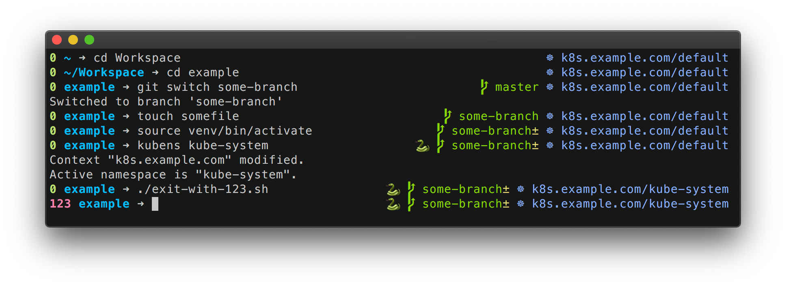

# samshell

A minimalist zsh theme with Git, Kubernetes and Python virtualenv decorations.



## Features

- Show Kubernetes context and namespace
- Show current Git branch
- Indicates uncommited changes 
- Indicates when a Python virtualenv is loaded
- Show the return code of the previous executed command
- Displays path relative to git root

## Installation

### Manual

```
mkdir -p $ZSH_CUSTOM/themes`
wget -O $ZSH_CUSTOM/themes/samshell.zsh-theme https://raw.githubusercontent.com/samuelb/samshell/master/samshell.zsh-theme`
echo 'ZSH_THEME="samshell"' >> ~/.zshrc
```

### With antigen

```
antigen theme samuelb/samshell
```

### With zgen

```
zgen load samuelb/samshell samshell
```

## Configuration

To disable the Kubernetes information, add `ZSH_SAMSHELL_KUBECTL_PROMPT=false` to
your .zshrc.

## Credits

Originally, I took the "pi" theme from https://github.com/tobyjamesthomas/pi and modified it.
