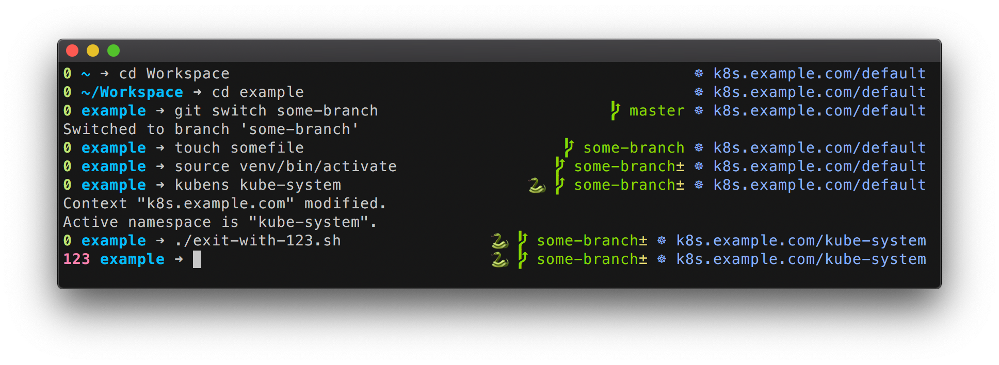

# samshell

A minimalist zsh theme with Git, Kubernetes and Python virtualenv decorations.



## Features

- Show Kubernetes context and namespace
- Show current Git branch
- Indicates uncommitted changes
- Indicates when a Python virtualenv is loaded
- Show the return code of the previous executed command
- Displays path relative to git root

## Requirements

- [oh-my-zsh](https://ohmyz.sh), or a plugin manager that loads its libraries
  (antigen: `antigen use oh-my-zsh`, zgen: `zgen oh-my-zsh`). The theme uses
  its colors and git prompt.
- Optional: [zsh-kubectl-prompt](https://github.com/superbrothers/zsh-kubectl-prompt)
  for the Kubernetes context and namespace.

## Installation

### Manual

```
mkdir -p $ZSH_CUSTOM/themes
wget -O $ZSH_CUSTOM/themes/samshell.zsh-theme https://raw.githubusercontent.com/samuelb/samshell/master/samshell.zsh-theme
```

Then set `ZSH_THEME="samshell"` in your `~/.zshrc`, replacing the existing
`ZSH_THEME` line. It has to come before oh-my-zsh is loaded
(`source $ZSH/oh-my-zsh.sh`).

### With antigen

```
antigen theme samuelb/samshell
```

### With zgen

```
zgen load samuelb/samshell samshell
```

## Configuration

To disable the Kubernetes information, add `ZSH_SAMSHELL_KUBECTL_PROMPT=false` to
your .zshrc.

## Credits

Originally, I took the "pi" theme from https://github.com/tobyjamesthomas/pi and modified it.
